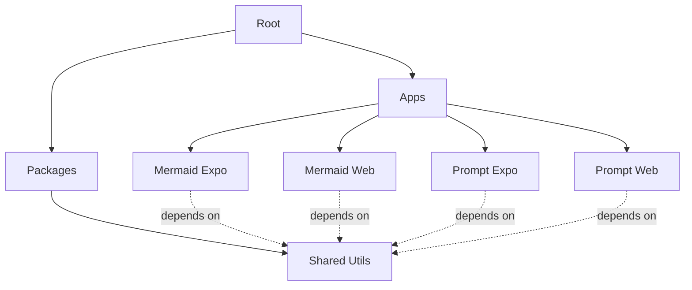

# Architecture Overview

## 📐 Monorepo Structure

```
cross-platform/
│
├── apps/                          # Application packages
│   ├── mermaid/
│   │   ├── expo/                 # 📱 Mobile (iOS/Android)
│   │   │   ├── app/              # Expo Router pages
│   │   │   ├── app.json          # Expo config
│   │   │   ├── eas.json          # EAS Build config
│   │   │   └── package.json
│   │   │
│   │   └── web/                  # 🌐 Web (Vercel)
│   │       ├── app/              # Next.js App Router
│   │       ├── next.config.js
│   │       ├── vercel.json       # Vercel config
│   │       └── package.json
│   │
│   └── prompt/
│       ├── expo/                 # 📱 Mobile (iOS/Android)
│       └── web/                  # 🌐 Web (Vercel)
│
├── packages/                      # Shared packages
│   └── shared-utils/             # 📦 Utility functions
│       ├── src/
│       │   ├── index.ts
│       │   └── index.test.ts
│       ├── package.json
│       └── tsconfig.json
│
├── package.json                   # Root package config
├── turbo.json                     # Turborepo pipeline config
└── .yarnrc.yml                    # Yarn 4 config
```

## 🔄 How It Works

### 1. Turborepo Orchestration

Turborepo manages the build pipeline:



### 2. Dependency Graph

```
┌─────────────────┐
│  shared-utils   │  Built first
└────────┬────────┘
         │
    ┌────┴─────┐
    ↓          ↓
┌─────────┐  ┌─────────┐
│ Web Apps│  │Expo Apps│  Built after dependencies
└─────────┘  └─────────┘
```

### 3. Yarn Workspaces

Yarn 4 links packages using `workspace:*` protocol:

```json
{
  "dependencies": {
    "@cross-platform/shared-utils": "workspace:*"
  }
}
```

Benefits:
- ✅ Single `node_modules` at root
- ✅ Shared dependencies (React, TypeScript, etc.)
- ✅ Instant updates when shared code changes
- ✅ Type-safe imports

## 🏗️ Build Pipeline

### Turbo Pipeline Configuration

```json
{
  "pipeline": {
    "build": {
      "dependsOn": ["^build"],         // Build dependencies first
      "outputs": [".next/**", "dist/**"]
    },
    "dev": {
      "cache": false,                  // Don't cache dev mode
      "persistent": true               // Keep running
    },
    "test": {
      "dependsOn": ["^build"]          // Test after building
    }
  }
}
```

### Execution Flow

```bash
$ yarn build

1. packages/shared-utils → build (tsc)
2. apps/mermaid/web → build (next build)
3. apps/prompt/web → build (next build)
```

Turbo runs steps 2 and 3 in **parallel** 🚀

## 📦 Package Types

### Apps (Private)

- Not published to npm
- Can depend on shared packages
- Have their own deployment targets

### Packages (Private, Internal)

- Shared across apps
- Built with TypeScript
- Output to `dist/`
- Type definitions included

## 🔀 Code Sharing Strategy

### ✅ What to Share

- **Business Logic**: API clients, data models, validation
- **Utilities**: Date formatting, string manipulation, math
- **Constants**: API URLs, configuration values
- **Types**: TypeScript interfaces and types

### ❌ What NOT to Share

- **UI Components**: Platform-specific (React Native vs React DOM)
- **Navigation**: Different routing systems
- **Platform APIs**: Camera, notifications, etc.

### 🔄 Hybrid Approach

For components that need to work everywhere:

```
packages/
└── ui/
    ├── src/
    │   ├── Button.tsx        # Shared interface
    │   ├── Button.native.tsx # React Native impl
    │   └── Button.web.tsx    # React DOM impl
```

## 🚀 Deployment Architecture

```
┌─────────────┐
│   GitHub    │
└──────┬──────┘
       │
   ┌───┴───┐
   │       │
   ↓       ↓
┌──────┐ ┌──────┐
│Vercel│ │  EAS │
└───┬──┘ └───┬──┘
    │        │
    ↓        ↓
┌──────┐ ┌──────┐
│ Web  │ │Mobile│
└──────┘ └──────┘
```

### Deployment Targets

| App | Platform | Service | Trigger |
|-----|----------|---------|---------|
| `mermaid/web` | Web | Vercel | Git push |
| `mermaid/expo` | iOS/Android | EAS | Manual/CI |
| `prompt/web` | Web | Vercel | Git push |
| `prompt/expo` | iOS/Android | EAS | Manual/CI |

## 🧪 Testing Strategy

### Unit Tests (Vitest)

```bash
packages/shared-utils/
├── src/
│   ├── index.ts
│   └── index.test.ts    # Unit tests here
```

### Integration Tests

```bash
apps/mermaid/web/
├── app/
│   ├── page.tsx
│   └── page.test.tsx    # Integration tests
```

### E2E Tests (Future)

- Web: Playwright
- Mobile: Detox or Maestro

## 📊 Performance

### Caching Strategy

Turbo caches based on:
- Input files (source code)
- Dependencies
- Environment variables

Cache hits = instant builds ⚡

### Remote Caching (Optional)

Share cache across team:

```bash
# Setup
npx turbo login
npx turbo link

# All team members benefit from shared cache
```

## 🔧 Development Workflow

### 1. Install Dependencies

```bash
yarn install
```

Yarn 4 creates a single `node_modules` with hoisted dependencies.

### 2. Development Mode

```bash
yarn dev
```

Turbo runs all `dev` scripts in parallel.

### 3. Make Changes

Edit any file → Hot reload in all affected apps.

### 4. Build

```bash
yarn build
```

Turbo builds in dependency order with parallelization.

### 5. Test

```bash
yarn test
```

Vitest runs tests across all packages.

## 🎯 Key Principles

1. **DRY (Don't Repeat Yourself)**
   - Share code via packages
   - One source of truth

2. **Separation of Concerns**
   - Apps: UI and platform-specific code
   - Packages: Shared logic and utilities

3. **Type Safety**
   - TypeScript everywhere
   - Shared types across apps

4. **Fast Builds**
   - Turborepo caching
   - Parallel execution
   - Only rebuild what changed

5. **Independent Deployment**
   - Each app deploys separately
   - Shared packages bundled in
   - No runtime dependencies

## 🔐 Security Considerations

- Secrets: Use environment variables
- Never commit: `.env.local`, API keys
- EAS Secrets: `eas secret:create`
- Vercel: Project settings → Environment Variables

## 📈 Scaling

### Adding New Apps

1. Create directory structure
2. Add `package.json`
3. Install dependencies: `yarn install`
4. Done! Turbo picks it up automatically

### Adding New Packages

1. Create in `packages/`
2. Add to apps: `"@cross-platform/pkg": "workspace:*"`
3. Import and use

### Adding New Platforms

- **Desktop**: Add `tauri/` directories
- **Extension**: Add `extension/` directories
- **API**: Add `api/` or `server/` in `apps/`

## 🎓 Learning Resources

- [Turborepo Handbook](https://turbo.build/repo/docs/handbook)
- [Yarn Workspaces](https://yarnpkg.com/features/workspaces)
- [Expo Monorepos](https://docs.expo.dev/guides/monorepos/)
- [Next.js + Turborepo](https://nextjs.org/docs/advanced-features/using-turbo)

